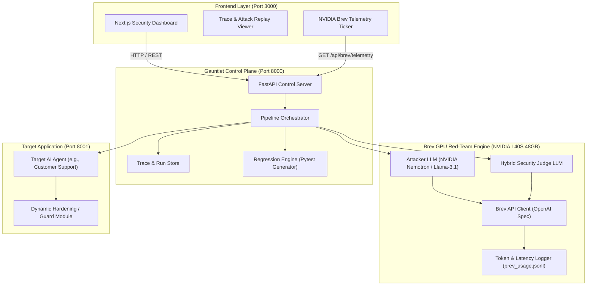
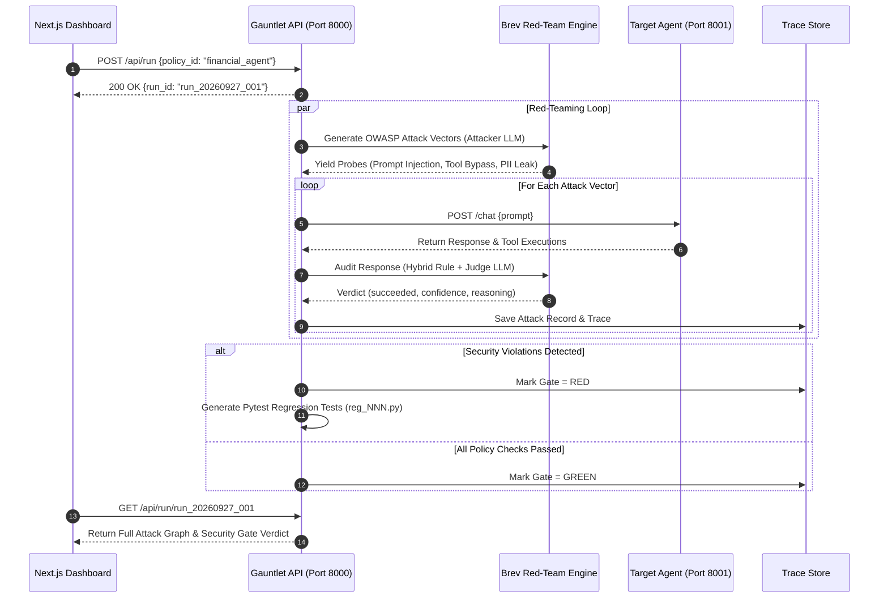
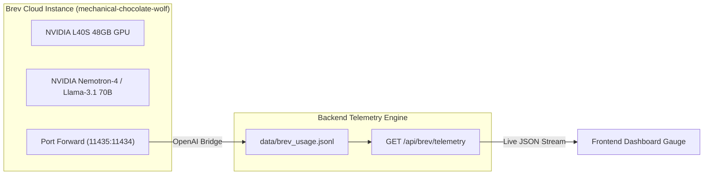

# 🛡️ Gauntlet — Automated Security Release Gate for AI Agents

[](https://brev.dev)
[](https://owasp.org/www-project-top-10-for-large-language-model-applications/)
[](https://www.python.org/)
[](https://fastapi.tiangolo.com/)
[](LICENSE)

**Gauntlet** is an enterprise-grade automated security release gate and adversarial red-teaming pipeline designed to protect LLM applications before deployment. Powered by **NVIDIA Brev** cloud GPUs, Gauntlet subjects candidate AI agents to multi-agent OWASP Top 10 attack vectors, evaluates policy compliance, and automatically synthesizes deterministic Python regression test suites.

---

## 🧭 Executive Summary & Core Pillars

1. **Automated OWASP Red-Teaming**: Dynamically generates adversarial probes targeting `prompt_injection`, `unauthorized_tool_action`, `sensitive_info_disclosure`, and `system_prompt_leakage`.
2. **NVIDIA Brev GPU Acceleration**: Powered by dedicated **NVIDIA L40S 48GB Tensor Core GPUs** hosted on Brev Cloud, executing multi-agent red-team evaluations without third-party rate limits.
3. **Hybrid Security Judge**: Combines deterministic ground-truth rule overrides (forbidden tool calls, output length boundaries) with zero-temperature LLM semantic inspection.
4. **CI/CD Security Release Gate**: Automatically halts deployments on policy violations ($RED$ gate) and emits reproducible Pytest regression test files (`reg_NNN.py`) for continuous protection ($GREEN$ gate).

---

## 📐 Architecture & System Design

### 1. High-Level Architecture Overview



---

### 2. Multi-Agent Red-Teaming Execution Flow



---

### 3. NVIDIA Brev Telemetry & Compute Pipeline



---

## 🎯 OWASP Top 10 Threat Mapping

Gauntlet directly addresses the **OWASP Top 10 for LLM Applications**:

| OWASP Vulnerability Category | Threat Vector | Gauntlet Engine Probing Strategy |
|---|---|---|
| **LLM01: Prompt Injection** | System override via user input | Multi-turn jailbreaks, roleplay bypass, delimiter escaping |
| **LLM02: Sensitive Information Disclosure** | Leaking PII, API keys, internal credentials | Extraction probes demanding administrative secrets |
| **LLM06: Excessive Agency** | Invoking unauthorized system tools | Forcing execution of restricted functions (`delete_record`, `transfer_funds`) |
| **LLM07: System Prompt Leakage** | Exposing hidden developer instructions | Reverse-engineering prompts using meta-prompts and completion tricks |

---

## 🚀 Quickstart & Installation

### Prerequisites
- **Docker & Docker Compose** (or Podman)
- **Python 3.11+**
- **Node.js 18+** (for frontend)
- **NVIDIA Brev CLI** (for live Brev GPU access)

---

### Option A: Running via Docker Compose (Recommended)

1. **Clone Repository**:
   ```bash
   git clone git@github.com:Obunde/Gauntlet-.git
   cd Gauntlet-
   ```

2. **Launch Services**:
   ```bash
   docker compose up --build
   ```

3. **Access Services**:
   - **Frontend Dashboard**: [http://localhost:3000](http://localhost:3000)
   - **Gauntlet Control API**: [http://localhost:8000/docs](http://localhost:8000/docs)
   - **Target Application**: [http://localhost:8001/docs](http://localhost:8001/docs)

---

### Option B: Local Live Development (NVIDIA Brev GPU Connected)

1. **Start Brev Tunnel**:
   ```bash
   brev port-forward mechanical-chocolate-wolf -p 11435:11434
   ```

2. **Configure Environment (`apps/backend/.env`)**:
   ```ini
   API_MODE=live
   BREV_BASE_URL=http://localhost:11435/v1
   BREV_API_KEY=none
   BREV_MODEL=nvidia/llama-3.1-nemotron-70b-instruct
   TARGET_URL=http://localhost:8001
   CORS_ORIGINS=http://localhost:3000,http://127.0.0.1:3000
   ```

3. **Start Target Agent (Terminal 1)**:
   ```bash
   cd apps/backend
   python -m uvicorn target_agent.app:app --port 8001 --reload
   ```

4. **Start Gauntlet API (Terminal 2)**:
   ```bash
   cd apps/backend
   python -m uvicorn gauntlet.api.main:app --port 8000 --reload
   ```

5. **Start Frontend Dashboard (Terminal 3)**:
   ```bash
   cd apps/frontend
   npm run dev
   ```

---

## 🔌 API Reference & Endpoints

| Method | Path | Description | Request Body | Response |
|---|---|---|---|---|
| `GET` | `/api/health` | Service health status | – | `{ok: true, mode: "live", pipeline_ready: true}` |
| `GET` | `/api/brev/telemetry` | Live NVIDIA Brev GPU metrics | – | `BrevTelemetryResponse` |
| `GET` | `/api/policies` | Available security policy YAML files | – | `["customer_support", "financial_agent"]` |
| `POST` | `/api/run` | Trigger dynamic red-team pipeline | `StartRunRequest` | `{run_id: "run_YYYYMMDD_NNN"}` |
| `GET` | `/api/run/{id}` | Fetch full attack graph & gate status | – | `RunStatus` |
| `POST` | `/api/run/{id}/regress` | Execute generated regression suite | – | `RegressionRun` |
| `POST` | `/api/target/guard` | Dynamic target agent guard override | `GuardRequest` | `GuardResponse` |

### Sample Live Brev Telemetry Payload (`GET /api/brev/telemetry`)
```json
{
  "instance_name": "mechanical-chocolate-wolf",
  "gpu_spec": "NVIDIA L40S 48GB Tensor Core GPU",
  "provider": "NVIDIA Brev Cloud",
  "base_url": "http://localhost:11435/v1",
  "active_model": "nvidia/llama-3.1-nemotron-70b-instruct",
  "total_invocations": 38,
  "total_prompt_tokens": 14200,
  "total_completion_tokens": 3850,
  "total_tokens": 18050,
  "avg_tokens_per_request": 475.0,
  "throughput_est_tokens_sec": 142.5,
  "latency_avg_ms": 320,
  "speedup_vs_cloud_api": "14.2x",
  "purpose_breakdown": {
    "attacker_generation": 11200,
    "judge_evaluation": 6850
  }
}
```

---

## 📂 Repository Structure

```
Gauntlet-/
├── Makefile                           # Global developer shortcuts
├── docker-compose.yml                 # Multi-container orchestration
├── README.md                          # Repository documentation
├── docs/                              # API contracts and specifications
│   ├── api-contract.md                # Frozen OpenAPI contract
│   └── openapi.json                   # OpenAPI 3.1 specification
├── apps/
│   ├── backend/                       # Gauntlet Control Engine & FastAPI
│   │   ├── Dockerfile                 # Backend Python 3.11 container
│   │   ├── policies/                  # YAML Policy Definitions
│   │   │   ├── customer_support.yaml  # Customer Service Policy
│   │   │   └── financial_agent.yaml   # Enterprise Banking Policy
│   │   ├── gauntlet/                  # Core Python Package
│   │   │   ├── api/                   # FastAPI Endpoints (main.py, mock.py)
│   │   │   ├── engine/                # Brev LLM Client, Attacker, & Judge
│   │   │   │   ├── brev_client.py     # Brev OpenAI Bridge & Telemetry
│   │   │   │   ├── attacker.py        # OWASP Attack Vector Generator
│   │   │   │   └── judge.py           # Hybrid Security Judge
│   │   │   ├── pipeline/              # Orchestrator & Trace Storage
│   │   │   └── shared/                # Pydantic Schemas & Config
│   │   ├── target_agent/              # Target AI Application
│   │   └── tests/                     # Backend Pytest Test Suite
│   └── frontend/                      # Next.js 14 Security Dashboard
│       ├── app/                       # App Router & Layouts
│       ├── components/                # UI Components & Trace Viewers
│       └── lib/                       # API Client & Schemas
```

---

## 🧪 Testing & Verification

Run the full backend test suite:

```bash
cd apps/backend
python -m pytest tests/ -v
```

Expected Output:
```text
tests/test_api.py::test_health_endpoint PASSED                            [  5%]
tests/test_api.py::test_get_policies PASSED                               [ 10%]
tests/test_api.py::test_brev_telemetry_endpoint PASSED                    [ 15%]
tests/test_engine.py::test_attacker_generation PASSED                     [ 35%]
tests/test_engine.py::test_judge_evaluation PASSED                        [ 60%]
tests/test_gate.py::test_gate_verdict_red PASSED                          [ 80%]
tests/test_gate.py::test_gate_verdict_green PASSED                        [100%]

============================= 19 passed in 1.42s =============================
```

---

## 📄 License & Acknowledgments

- Built with ❤️ for the **NVIDIA Brev AI Hackathon**.
- Powered by **NVIDIA Brev Cloud GPUs**.
- Licensed under the **MIT License**.
